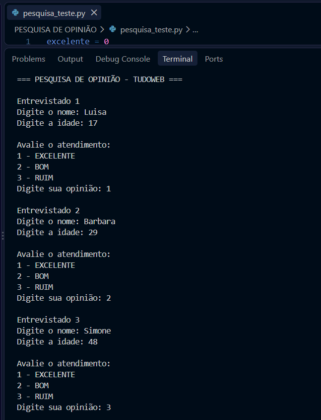
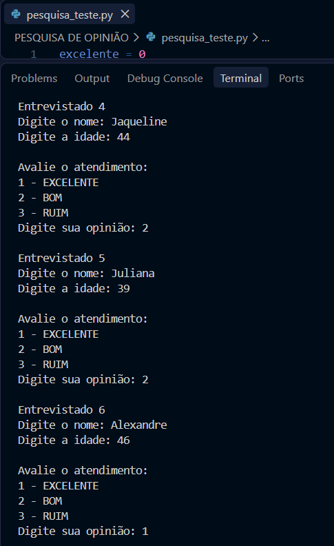
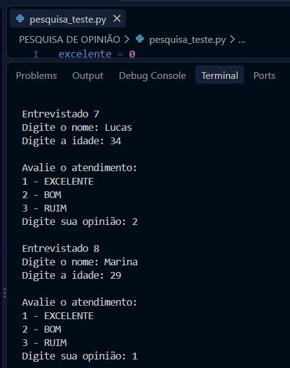
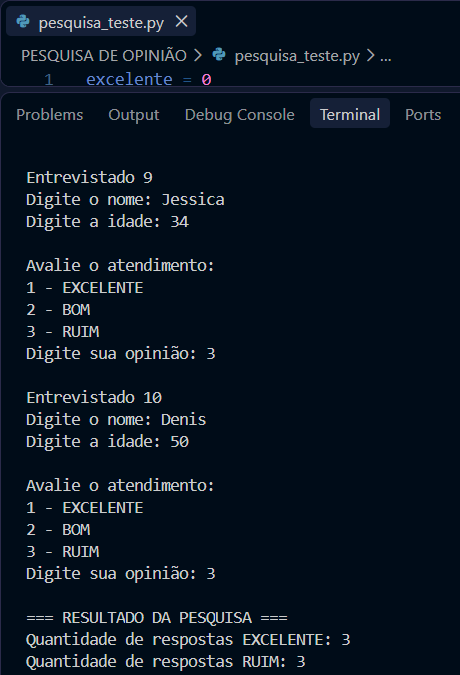

# 📊 Pesquisa de Opinião — TudoWeb

## 📝 Sobre o projeto

Este projeto foi desenvolvido em **Python** com o objetivo de realizar uma pesquisa de opinião sobre o atendimento prestado pela empresa **TudoWeb**.

O programa coleta informações dos entrevistados e registra a avaliação do atendimento, permitindo contabilizar, ao final da pesquisa, a quantidade de respostas **EXCELENTE** e **RUIM**.

---

## 🎯 Objetivo

Desenvolver um programa utilizando **estrutura de repetição** e **estruturas de decisão** para coletar e analisar as respostas de uma pesquisa de satisfação.

Para cada entrevistado, o programa solicita:

- 👤 Nome
- 🎂 Idade
- ⭐ Opinião sobre o atendimento

As opções de avaliação são:

- `1` — EXCELENTE
- `2` — BOM
- `3` — RUIM

A pesquisa definitiva deve ser realizada com **50 entrevistados**.

---

## 🔄 Funcionamento do programa

O programa utiliza a estrutura de repetição `for` para realizar a pesquisa com os entrevistados.

As estruturas condicionais `if`, `elif` e `else` são utilizadas para verificar a opinião informada por cada participante.

Ao final da pesquisa, o programa apresenta:

- Quantidade de respostas **EXCELENTE**
- Quantidade de respostas **RUIM**

---

## 🧪 Teste de validação

Antes da execução da pesquisa definitiva, foi realizado um teste com **10 entrevistados**, conforme solicitado na atividade.

Na versão de teste, foi utilizada a seguinte estrutura:

```python
for entrevistado in range(1, 11):
```

O teste permitiu verificar o funcionamento da estrutura de repetição, a entrada dos dados dos entrevistados, a classificação das opiniões e a contabilização dos resultados.

---

## 📸 Evidências dos testes realizados

Para demonstrar o funcionamento do programa, foram registradas capturas de tela durante a execução do teste com os entrevistados.

### Resultado do teste 1



### Resultado do teste 2



### Resultado do teste 3



### Resultado do teste 4



As imagens acima registram a execução do programa e servem como evidência da realização dos testes de validação.

---

## 👥 Pesquisa definitiva

Após a validação com 10 entrevistados, a versão definitiva foi configurada para realizar a pesquisa com **50 entrevistados**.

Para isso, a estrutura de repetição utiliza:

```python
for entrevistado in range(1, 51):
```

Dessa forma, o programa atende ao requisito da atividade de realizar a pesquisa com 50 participantes.

---

## 💻 Estrutura principal do programa

```python
excelente = 0
ruim = 0

print("=== PESQUISA DE OPINIÃO - TUDOWEB ===")

for entrevistado in range(1, 51):
    print(f"\nEntrevistado {entrevistado}")

    nome = input("Digite o nome: ")
    idade = int(input("Digite a idade: "))

    print("\nAvalie o atendimento:")
    print("1 - EXCELENTE")
    print("2 - BOM")
    print("3 - RUIM")

    opiniao = int(input("Digite sua opinião: "))

    if opiniao == 1:
        excelente += 1
    elif opiniao == 2:
        pass
    elif opiniao == 3:
        ruim += 1
    else:
        print("Opinião inválida!")

print("\n=== RESULTADO DA PESQUISA ===")
print("Quantidade de respostas EXCELENTE:", excelente)
print("Quantidade de respostas RUIM:", ruim)
```

---

## 📂 Arquivos do projeto

O projeto contém os seguintes arquivos:

```text
PESQUISA DE OPINIÃO/
│
├── pesquisa_teste.py
├── pesquisa_definitiva.py
├── README.md
├── resultado_teste_1.png
├── resultado_teste_2.png
├── resultado_teste_3.png
└── resultado_teste_4.png
```

- **pesquisa_teste.py** — versão utilizada para os testes com 10 entrevistados.
- **pesquisa_definitiva.py** — versão definitiva preparada para 50 entrevistados.
- **README.md** — documentação do projeto.
- **resultado_teste_1.png a resultado_teste_4.png** — evidências da execução e validação do programa.

---

## ▶️ Como executar

1. Tenha o **Python** instalado no computador.
2. Abra a pasta do projeto no **Visual Studio Code**.
3. Abra o arquivo Python desejado.
4. Execute o programa.
5. Informe o nome, a idade e a opinião de cada entrevistado.
6. Ao final, o programa exibirá a quantidade de respostas **EXCELENTE** e **RUIM**.

---

## 📚 Conceitos utilizados

Neste projeto foram aplicados os seguintes conceitos de programação:

- Variáveis
- Entrada de dados com `input()`
- Conversão de dados com `int()`
- Estrutura de repetição `for`
- Estruturas condicionais `if`, `elif` e `else`
- Contadores
- Operadores de comparação
- Saída de dados com `print()`

---

## 🛠️ Tecnologias utilizadas

- 🐍 Python
- 💻 Visual Studio Code
- 🐙 Git
- 🌐 GitHub

---

## 👩‍💻 Autora

Desenvolvido por **Georgia Salma Hayatt** como atividade prática de programação em Python.
